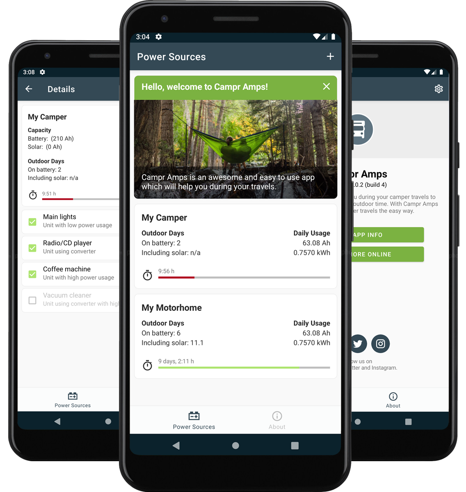

# Welcome to Campr Amps
Here you'll find the primary repositorie I'm working on, monthly iteration plans with key changes I plan to make, 
and issues containing discussions around new features and changes to this app. 

:zap: **Campr Amps** is a mobile app to calculate self-sufficient outdoor time for camper users and to get insights in power usage, based on available battery (Ah), an optional converter and solar panels. Source code is managed privately in Microsoft DevOps. Project is publicly managed in this repository. 

Available on App Store and Google Play when released.

## Project:
- Have an issue or suggestion? [Let me know!](https://github.com/Sw1ma/campr-amps/issues/new/choose)  
- Do you want to contribute as [beta tester](https://github.com/Sw1ma/campr-amps/blob/master/.github/CONTRIBUTING.md)?
- I encourage you to read [this wiki](https://github.com/Sw1ma/campr-amps/wiki) to get more insights.
- Get project [progress](https://github.com/Sw1ma/campr-amps/projects/1) insights.

## Build Status:
| Build Server | Type | Platform | Target | Status |
|--|--|--|--|--|
| App Center | Build, Launch | MacOS | Andriod |  |
| App Center | Build, Launch | MacOS | iOS  |  |

## NuGet Packages:
| Package | Build Server| Type | Release |
|--|--|--|--|
| Campr.Forms | DevOps | Build |  |
| Campr.Core | DevOps | Build | | 
| Campr.Platform | DevOps | Buid |  | 

## Release notes
See [changelog](./CHANGELOG.md) for overall release notes.

## Tools and technologies
* Visual Studio Community Edition 2019
* App Center (CI, Build, Test, Distribute)
* Azure DevOps (CI, Build Pipelines, Source Control)
* GitHub (Project Management)

## Design guidelines
- Following Microsoft [Framework Design Guidelines](https://docs.microsoft.com/en-us/dotnet/standard/design-guidelines/)  

## Color guidelines
- Using Android [material color scheme](https://material.io/resources/color/#!/?view.left=0&view.right=0&primary.color=344955&secondary.color=F9AA33)

## Basic coding guidelines:
- No leading "this."
- Single type per file
- Member variables are camelCased with _prefix
- Local variables are camelCased with no prefix 
- Types, properties, methods, events are PascalCased
- Use new C# features (e.g nameof) where possible, but keep the code readable (e.g. don't var everything)

## Third-Party Resources
- [Material Design Icons v3.8.95](https://cdn.materialdesignicons.com/3.8.95/)

## Made Possible By
- [Xamarin.Essentials](https://docs.microsoft.com/xamarin/essentials)
- [Xamarin.Forms](https://xamarin.com/forms)
- [Xamarin.Forms.Visual.Material](https://docs.microsoft.com/xamarin/xamarin-forms/user-interface/visual/)
- [MVVM Helpers, James Montemagno](https://github.com/jamesmontemagno/mvvm-helpers)
- [Android Asset Studio, Roman Nurik](https://romannurik.github.io/AndroidAssetStudio/index.html)

## License & Copyright
Copyright (c) 2020, Xlpina Mobile Apps by Martin Swinkels  
See [license](./LICENSE) file.

Apple, iPhone, and iPad are trademarks of Apple Inc., registered in the U.S. and other countries and regions. App Store is a service mark of Apple Inc.  
Google Play and the Google Play logo are trademarks of Google LLC.
